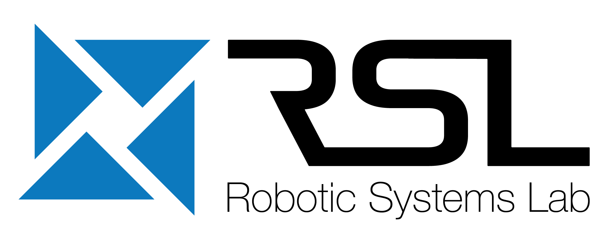
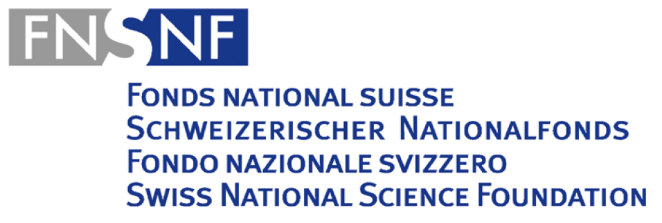
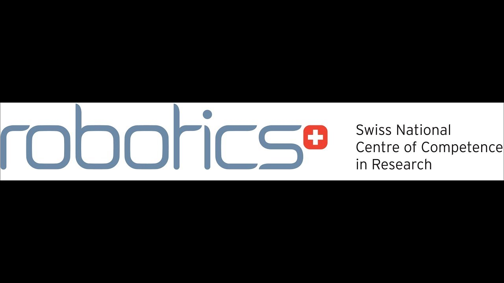
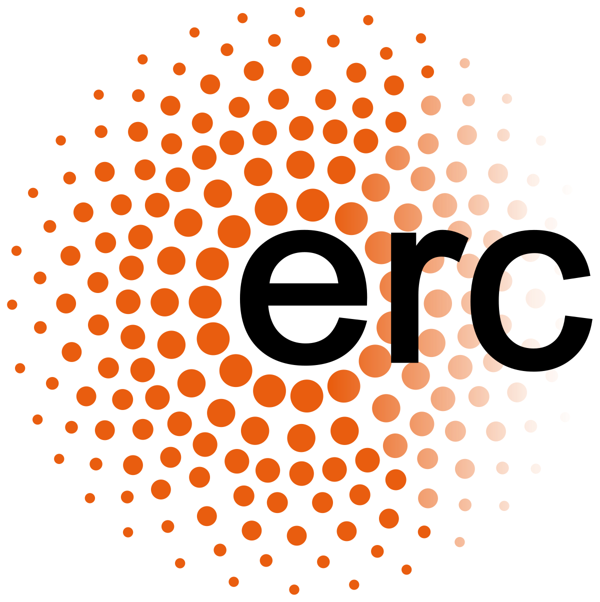

## Research Institute
Noesis was developed at the [Robotic Systems Lab](https://rsl.ethz.ch/) of ETH Zurich.

----
## Financial Support
This work was supported by Intel Labs, the Swiss National Science Foundation
(SNSF) through project 166232, 188596, the National Centre of Competence
in Research Robotics (NCCR Robotics), and the European Union’s Horizon
2020 research and innovation program under grant agreements No.780883 and
European Research Council (ERC) No.852044. Additionally, this work has
been conducted as part of ANYmal Research, a community to advance legged
robotics.

----
