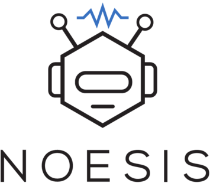

-----------------
## Overview

Noesis is a software toolbox for applying deep reinforcement learning to robotics problems. 

This **pre-release** version currently is tested under Ubuntu 20.04 LTS, and supports `C++14` and Python `3.7`.

The toolbox consists of the following main components:
1. **`noesis`:** A CMake package providing the following C++ libraries:   
    * `framework`: Computational and operational core libraries for graphs, tensors, logging, system access etc.    
    * `mdp`: A generalized interface for defining Markov Decision Processes (MDP) (i.e. environments).    
    * `gym`: Interfaces to physics engines, and implementations of various environments    
    * `rl`: Interfaces to DRL algorithms and relevant components.    
2. **`noesis_py`:** A `pip` package providing the Python back-end for building computation-graphs using TensorFlow.    
3. **`examples`:** Example programs for exploring the functionality and components of the library.

Lastly, all C++ components are built using CMake, but also support [`catkin`](https://catkin-tools.readthedocs.io/en/latest/). 
The latter is typically the tool of choice in the robotics community due to the ubiquity of [ROS](http://www.ros.org/). For 
python, we use `virtualenv` and `virtualenvwrapper` for package management.

**Maintainer:** Vassilios Tsounis  
**Affiliation:** Robotic Systems Lab, ETH Zurich  
**Contact:** vastsoun@gmail.com

## Install

Please see [these](./utils/install/README.md) instructions on how to install Noesis and all relevant dependencies.

## Build

### CMake

Building `noesis` can be performed anywhere in the user's home directory using CMake. We provide an example in 
the form of a CMake project template in the `utils/workspace` directory. We recommend using this 
for getting started on own projects. See [directory](./utils/workspace) for details.

### Catkin

For building with Catkin, please refer to [this](https://catkin-tools.readthedocs.io/en/latest/) 
resource on how to install, configure and use catkin.
```commandline
mkdir -p catkin_ws/src
cd catkin_ws
catkin init
catkin config --cmake-args -DCMAKE_BUILD_TYPE=Release 
catkin build noesis_examples
```

Now we can test the build by executing any of the examples. Let's try the `framework_hello` example:
```commandline
user@ubuntu:~$ ./build/noesis/noesis_examples/framework_hello
```

## Dependencies

Noesis has `apt`, `pip` and source dependencies. 

### APT
All `apt` dependencies are installed by the `install.sh` script (see installation instructions below):  

* **[Python 3.7](https://www.python.org/downloads/release/python-3716/):** Current default version of Python 3.7 provided by the [dead-snakes](https://launchpad.net/~deadsnakes) repos.
* **[GCC 9.4](https://launchpad.net/~ubuntu-toolchain):** GNU C/C++ Compiler (GCC) v9 provided by the advanced Ubuntu toolchain repository.  
* **[CMake](https://cmake.org):** CMake is an open-source, cross-platform family of tools designed to build, test and package software.
* **[OpenMP 4.5](https://www.openmp.org/uncategorized/openmp-45-specs-released/):** OpenMP 4.5 provided by GCC 9.  
* **[Boost](https://www.boost.org/):** Free peer-reviewed portable C++ source libraries.  
* **[TinyXML](https://sourceforge.net/projects/tinyxml/):** TinyXML is a simple, small, minimal, C++ XML parser that can be easily integrating into other programs.
* **[SDL2](https://www.libsdl.org/download-2.0.php):** SDL is a cross-platform development library providing abstractions based on OpenGL.  
* **[SFML](https://www.sfml-dev.org/):** Simple and Fast Multimedia Library used for drawing 2D graphics.  
* **[STB](https://github.com/nothings/stb):** STB is a set of single-file public domain libraries for C/C++. Only the parts for image processing are used.  
  
**Note**: STB is already provided in-source in `noesis/include/stb` and no action needs to be taken for it's installation.
  
### PIP
All `pip` dependencies are automatically installed when by the `noesis_py` package via the `install.sh` script:  

* **[TensorFlow 1.15](https://github.com/tensorflow/tensorflow):** Computation using data flow graphs for scalable machine learning.  
  
### Source
Noesis has a single source dependency on TensorFlow-Cpp, a CMake-based re-packaging of the C/C++ interface to TensorFlow, and can be retrieved from the respective 
`tensorflow-cpp` GitHub repository. The aforementioned carries with it the following packages:  

* **[Eigen3](https://bitbucket.org/eigen/eigen):** Eigen is a C++ template library for linear algebra: matrices, vectors, numerical solvers, and related algorithms.  
* **[TensorFlow-Cpp](https://github.com/tensorflow/tensorflow):** CMake package providing the headers and libraries for the C/C++ API of TensorFlow.  

## Bugs & Feature Requests

Please report bugs and request features using the [Issue Tracker](https://github.com/leggedrobotics/noesis/issues).

## License

[Apache License 2.0](LICENSE.md)

## Citing

If you use Noesis, please cite as:
```
@phdthesis{tsounis2023thesis,
year = {2023},
type = {Doctoral Thesis},
institution = {ETH Zurich},
publisher = {ETH Zurich},
school = {ETH Zurich},
author = {Vassilios Tsounis},
title = {Applications of Reinforcement Learning to Motion Planning & Control of Quadrupedal Robots},
copyright = {In Copyright - Non-Commercial Use Permitted}
}
```

## Acknowledgements

See [AUTHORS.md](AUTHORS.md) for the complete list of authors and contributors and [ACKNOWLEDGEMENTS.md](ACKNOWLEDGEMENTS.md) for affiliations and funding accreditation.

----
